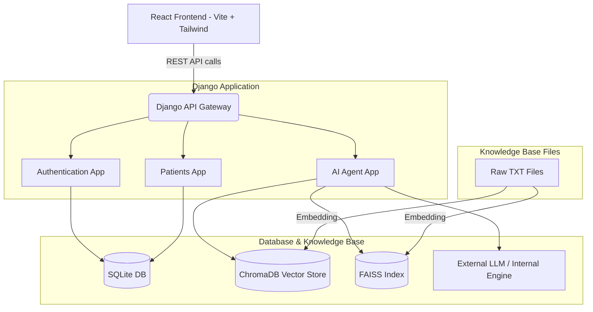

# System Architecture

The MediBot system consists of three main pillars: a React frontend, a Django backend, and an AI RAG (Retrieval-Augmented Generation) pipeline.

## High-Level Architecture Diagram

## Components

1. **Frontend**: [[Frontend_Overview]]
2. **Backend**: [[Backend_Overview]]
3. **RAG Pipeline**: [[RAG_Knowledge_Base]]
