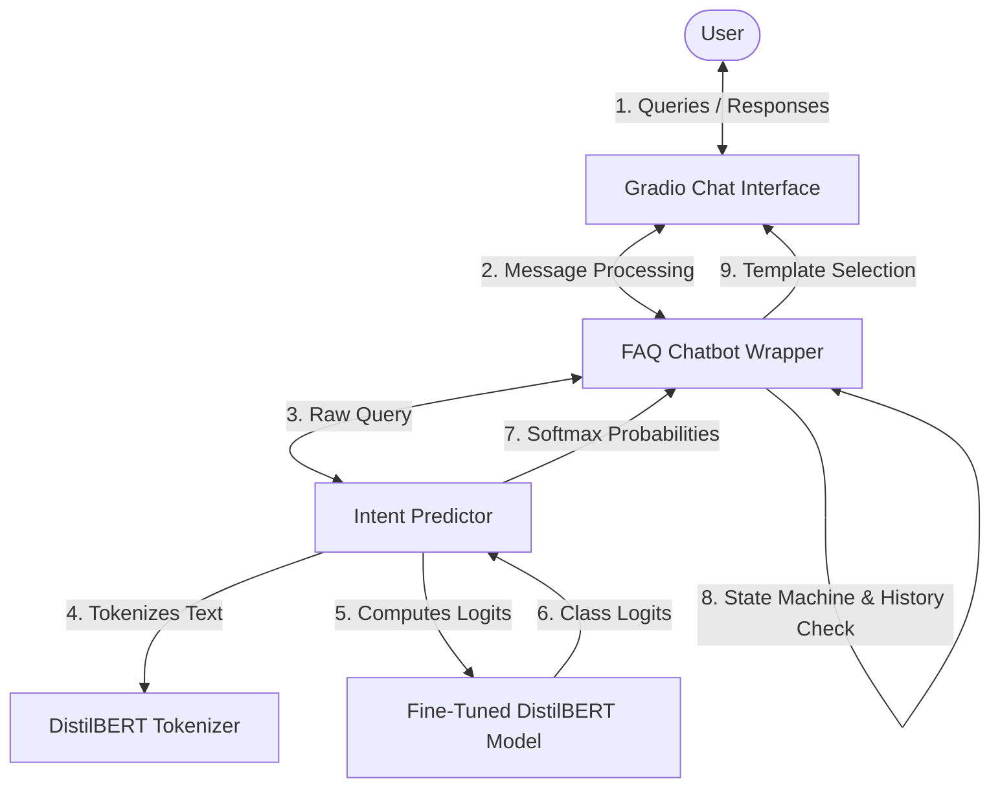
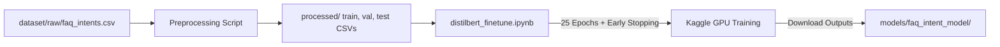

# FAQ Intent Classification Chatbot

An enterprise-ready, modular customer-support chatbot powered by a fine-tuned **DistilBERT** (Sequence Classification) model. The system classifies user inquiries into one of 14 specific customer service intents in real-time, manages conversation memory, and resolves multi-turn contexts (like deletion confirmation flows).

---

## 🏗️ Project Architecture

The system consists of a data preprocessing pipeline, a training notebook optimized for Kaggle GPU environments, and a local inference package organized into clean, reusable modules.

### Conversational & Inference Pipeline


### Dataset & Fine-Tuning Workflow


---

## 📁 Folder Structure

```
distilbert_mini_project/
├── dataset/                         # Dataset directory
│   ├── README.md                    # Dataset documentation
│   ├── raw/
│   │   └── faq_intents.csv          # Raw FAQ dataset (210 samples, 14 classes)
│   └── processed/                   # Preprocessed CSVs and label maps
│       ├── train.csv                # Training set (146 samples)
│       ├── val.csv                  # Validation set (32 samples)
│       ├── test.csv                 # Test set (32 samples)
│       └── label_maps.json          # id2label / label2id mapping definitions
├── models/                          # Storage for trained weights
│   └── faq_intent_model/            # Downloaded model files (config, weights, tokenizer)
├── reports/                         # Evaluation artifacts
│   ├── confusion_matrix.png         # Heatmap plot of evaluation results
│   └── evaluation_report.json       # JSON containing full precision/recall/f1 metrics
├── src/                             # Python source package
│   ├── __init__.py
│   ├── config.py                    # Path definitions and hyperparameters
│   ├── evaluate.py                  # Evaluation & metrics generation
│   ├── predictor.py                 # Predictor class and CLI prediction utility
│   ├── chatbot.py                   # Chatbot class with memory & state confirmation
│   └── app.py                       # Gradio UI runner
├── distilbert_finetune.ipynb        # Kaggle GPU training notebook
├── requirements.txt                 # Project dependencies
└── README.md                        # Project documentation (this file)
```

---

## ⚙️ Installation Guide

### Prerequisites
- Python 3.8 or higher
- Pip (Python Package Installer)
- (Optional) CUDA-supported GPU for faster local predictions

### Step-by-Step Setup

1. **Clone or Navigate to the Directory**:
   ```bash
   cd distilbert_mini_project
   ```

2. **Create and Activate a Virtual Environment** (Recommended):
   - **Windows (PowerShell)**:
     ```powershell
     python -m venv venv
     .\venv\Scripts\Activate.ps1
     ```
   - **macOS/Linux**:
     ```bash
     python3 -m venv venv
     source venv/bin/activate
     ```

3. **Install Dependencies**:
   ```bash
   pip install -r requirements.txt
   ```

4. **Add Trained Model Weights**:
   Ensure you have downloaded the fine-tuned model files from Kaggle and placed them in:
   `models/faq_intent_model/`
   
   The directory should contain:
   - `config.json`
   - `model.safetensors`
   - `tokenizer.json`
   - `tokenizer_config.json`
   - `vocab.txt`
   - `special_tokens_map.json`

---

## 🚀 Usage Guide

The codebase is split into specific entrypoints for evaluation, CLI inspection, and the web interface:

### 1. Model Evaluation & Metrics
Run the local evaluation suite to check classification metrics on the test dataset and generate a confusion matrix heatmap:
```bash
python -m src.evaluate
```
- **Outputs**: Generates a plot at `reports/confusion_matrix.png` and classification metrics at `reports/evaluation_report.json`.

### 2. Command-Line Prediction Utility
Inspect intent predictions for a single query from your terminal:
```bash
python -m src.predictor "How do I reset my password?"
```
- **Interactive Mode**: Run without arguments to launch a real-time prompt loop:
  ```bash
  python -m src.predictor
  ```

### 3. Command-Line Chatbot Wrapper
Simulate a chat conversation with state validation and dialogue history directly in your console:
```bash
python -m src.chatbot
```
- Type `clear` to empty conversational memory, or `exit` to close the prompt.

### 4. Gradio Web Interface
Launch a beautiful web-based interface featuring an interactive chat panel and real-time classification metrics:
```bash
python -m src.app
```
- Open `http://127.0.0.1:7860` in your web browser.
- **Left Column**: Type queries or select example prompts to converse with the bot.
- **Right Column**: Displays predicted intent, a confidence slider, and a bar chart outlining top probabilities.

---

## 🔮 Future Improvements

1. **Dataset Expansion**: Expand raw training data to at least 50–100 samples per class to boost generalization.
2. **Contextual Fallbacks**: Connect the intent classifier to a generative Large Language Model (e.g. Gemini, Llama) so that off-topic or general queries receive natural responses instead of fallback templates.
3. **Multi-turn State Enhancements**: Integrate a database (e.g. SQLite, Redis) to persist conversation memory across restarts.
4. **API Deployment**: Wrap the `IntentPredictor` in a FastAPI service and containerize with Docker for hosting on AWS, GCP, or Hugging Face Spaces.

---

## 📄 License

This project is open-source software licensed under the [MIT License](https://opensource.org/licenses/MIT).

Copyright (c) 2026. All rights reserved.
